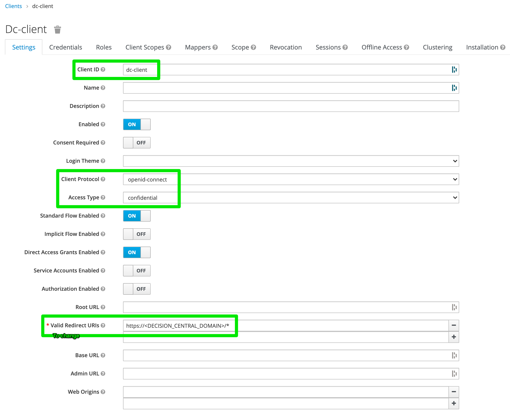
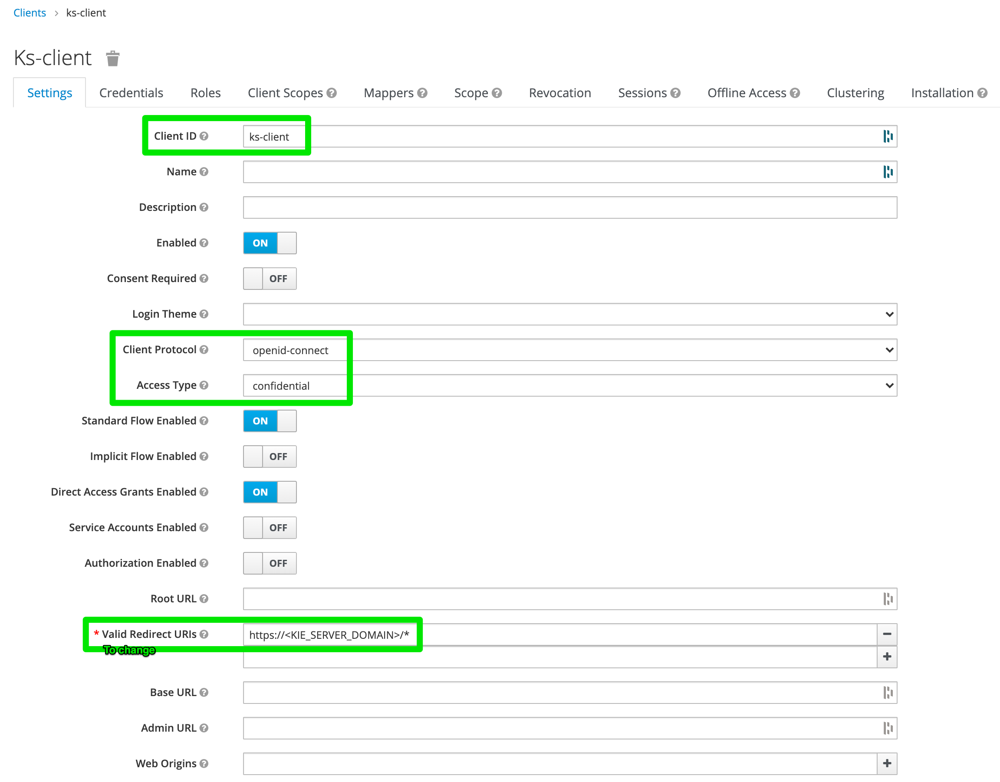

# KieApps examples for the Business Automation Openshift operator

## Prerequisites

You will need:

- Openshift 4.6+ up and running
- A new openshift project
- The Business Automation operator installed

## Decision Manager KieApps examples

### DM Trial environments

- [my-decision-svc-trial.yml](my-decision-svc-trial.yml)

### DM Authoring environments

- [my-decision-svc-design-time.yml](my-decision-svc-design-time.yml)
- [my-decision-svc-design-time-cpu-mem.yml](my-decision-svc-design-time-cpu-mem.yml)
- [my-decision-svc-design-time-sso.yml](my-decision-svc-design-time-sso.yml)

  - Decision Central SSO Client config  
    

  - Kie Server SSO Client Config:
    

### DM Runtime environments

- TO_ADD
- TO_ADD

## Process Automation Manager KieApps examples

### PAM Trial environments

- [my-process-svc-trial.yml](my-process-svc-trial.yml)

### PAM Modeling environments

- [my-process-svc-design-time.yml](my-process-svc-design-time.yml)

### PAM Runtime environments

- [my-process-svc-runtime-b2i.yml](my-process-svc-runtime-b2i.yml)
- [my-process-svc-runtime-b2i-pim.yml](my-process-svc-runtime-b2i-pim.yml)

## Other examples
- [https://github.com/kiegroup/kie-cloud-operator/tree/main/deploy/crs/v2](https://github.com/kiegroup/kie-cloud-operator/tree/main/deploy/crs/v2)